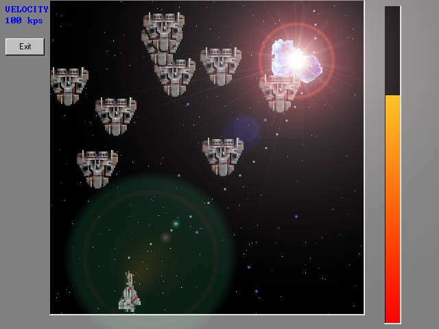



## Return of the Avenger \- the ultimate VB game

### Description

A very cool VB space simulation game. This project is for everyone that claims VB can't be used as a game engine. Using home-made buffering methods, I re-wrote the Raptor game engine in VB. Your ship shoots, the bad guys shoot, ships explode, music is played (mp3 format) - this engine has everything. If you've liked the little arcade games people have posted (pong, etc.), you'll be blown away by this full-scale game using hundreds of blits simultaneously. Everything you need is included (including the ocx for playing mp3's), and the code is very concise, clever, and fast. One thing - it's not quite commented fully and the user interface needs some work. I had to rush and finish it for a school project, so there is much left to be done. I am looking for someone to do custom graphics (I am using the ones from Raptor for now) and I will revamp the game to be entirely like Raptor (level editors, weapon upgrades, etc.) for commercial distribution. Contact me (tannerhelland@hotmail.com) if interested.

BTW - use the arrow keys to move and the space bar to shoot.
 
### More Info
 
This project is for everyone that claims VB can't be used as a game engine. Using home-made buffering methods, I re-wrote the Raptor game engine in VB. Your ship shoots, the bad guys shoot, ships explode, music is played (mp3 format) - this engine has everything. If you've liked the little arcade games people have posted (pong, etc.), you'll be blown away by this full-scale game using hundreds of blits simultaneously. Everything you need is included (including the ocx for playing mp3's), and the code is very concise, clever, and fast. One thing - it's not quite commented fully and the user interface needs some work. I had to rush and finish it for a school project, so there is much left to be done. I am looking for someone to do custom graphics (I am using the ones from Raptor for now) and I will revamp the game to be entirely like Raptor (level editors, weapon upgrades, etc.) for commercial distribution. Contact me (tannerhelland@hotmail.com) if interested.

BTW - use the arrow keys to move and the space bar to shoot.

             |
---                |---
**Submitted On**   |2000-04-05 12:53:38
**By**             |[Tanner Helland](https://github.com/Planet-Source-Code/PSCIndex/blob/master/ByAuthor/tanner-helland.md)
**Level**          |Advanced
**User Rating**    |4.8 (53 globes from 11 users)
**Compatibility**  |VB 5\.0, VB 6\.0
**Category**       |[Games](https://github.com/Planet-Source-Code/PSCIndex/blob/master/ByCategory/games__1-38.md)
**World**          |[Visual Basic](https://github.com/Planet-Source-Code/PSCIndex/blob/master/ByWorld/visual-basic.md)
**Archive File**   |[CODE\_UPLOAD4549452000\.zip](https://github.com/Planet-Source-Code/tanner-helland-return-of-the-avenger-the-ultimate-vb-game__1-6856/archive/master.zip)

### API Declarations

BitBlt, sndPlaySound, SetPixelV

